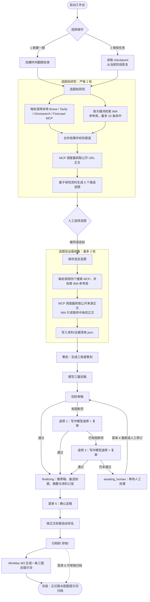

# 熵减进化室 · 内容工坊

公众号「熵减进化室」的内容编排工作台。本仓库**不是软件项目**，主产物是中文公众号成稿（约 3000 字）与配套提示词/配图。

- 跨期约定与归属规则：[AGENTS.md](AGENTS.md)
- 本期实施计划：[PLAN.md](PLAN.md)

## 三专栏

| 专栏 | 审稿侧重 |
|---|---|
| 大模型二三事 | 模型能力与宣传口径 |
| AI 风险治理与审计 | 风险措施、法域、标准版本 |
| 开源项目 | 许可证、维护状态、实测边界 |

## 仓库布局

```
根目录/
├── AGENTS.md            # 跨期约定、归属规则、视觉/文体纪律
├── PLAN.md              # 当前实施计划
├── README.md            # 本文件
├── 启动工作台.bat       # Windows 入口（C：数字工作台）
├── 启动工作台.command   # macOS/Linux 入口（C：数字工作台）
├── 工作台/
│   ├── 接入/            # 模型与搜索（A：模型与搜索）
│   ├── 流水线/          # 策划→三稿→审稿→返修（B：内容流水线）
│   └── 菜单/            # 数字菜单、任务浏览、定稿/归档入口（C：数字工作台）
├── 配置/                # 运行配置样例（环境无关字段，不含密钥）
├── 提示词/              # 跨期可复用提示词模板
├── 进行中/时间戳-专栏/  # 当期工作区（选题/资料/策划/三稿/审稿/待定稿/运行记录）
└── 存档/时间戳/         # 已归档的历史期
```

每期新建一个 `YYYY-MM-DD-HH-MM-SS-专栏` 目录放在 `进行中/`；定稿确认后可由 5 号菜单自动归档，也可由 6 号菜单单独归档，整体迁入 `存档/`。

## 主菜单

```
1 新建一期      2 继续任务      3 查看稿件      4 重跑步骤
5 导入手改稿/定稿                6 归档          7 历史存档
8 配置          9 诊断          0 退出
```

## 本项目流程图



## 凭据与隐私

- 真实 Base URL、API Key、MCP 启动参数首次使用时在本地隐藏输入；不在仓库内保存。
- `.gitignore` 默认忽略 `.env`、`*.key`、`配置/本地.toml`、`配置/本期.toml`、`配置/凭据/`、`.workbuddy/` 备忘。
- 日志脱敏，模型返回的正文仅作资料，不当作执行指令。

## 与外部开源资料的关系

外部参考文件统一前缀 `外部开源-灵感来源-`，归属仅写在文件名上。结构、版式可借鉴，原创句子、标题、数据以当期提示词与原报告为准。
